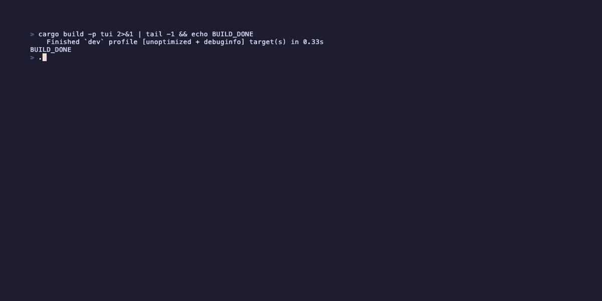

# devwatch

A cross-platform GitHub / GitLab PR monitor with a terminal UI and a desktop GUI, written in Rust.

<!-- TUI demo — regenerate with: vhs demo/tui.tape -->
<!--  -->

<!-- Tauri desktop app screenshot -->
<!--  -->

## Architecture

```
┌──────────────────────────────────────────────────────────────────┐
│  config.toml  ·  repos, tokens, poll interval, daemon port       │
└──────────────────────┬───────────────────────────────────────────┘
                       │
                       ▼
        ┌──────────────────────────────┐
        │           daemon             │
        │  ┌──────────┐  ┌──────────┐  │
        │  │  poller  │→ │  state   │  │
        │  │ (github/ │  │(in-mem + │  │
        │  │  gitlab) │  │ SQLite)  │  │
        │  └──────────┘  └──────────┘  │
        │                              │
        │  JSON / TCP  127.0.0.1:7878  │
        └──────┬───────────────────────┘
               │
       ┌───────┴────────┐
       │                │
       ▼                ▼
  crates/tui       crates/tauri-app
  Terminal UI       Desktop GUI
  (ratatui)         (Tauri + React)
```

## Prerequisites

- Rust stable (`rustup update stable`)
- A GitHub [Personal Access Token](https://github.com/settings/tokens) with the `repo` scope

For the desktop app only:

- Node.js ≥ 18
- `cargo tauri` CLI: `cargo install tauri-cli`

## Setup

1. Copy and edit the config:
   ```sh
   cp examples/config.example.toml config.toml
   $EDITOR config.toml
   ```

2. Fill in your GitHub token and repos:
   ```toml
   [[repos]]
   provider = "github"
   name     = "myorg/myrepo"
   token    = "ghp_..."
   ```

   Alternatively, export the token and omit it from the config:
   ```sh
   export GITHUB_TOKEN=ghp_...
   ```

## Build

```sh
# Build everything (daemon + TUI):
cargo build --workspace

# Build the desktop app (requires Node.js):
cargo tauri build -p tauri-app
```

## Run

### TUI (terminal UI)

```sh
cargo run -p tui
```

The TUI **auto-starts the daemon** if it isn't already running — no need to
launch two terminals.  It locates the `daemon` binary as a sibling of the
`devwatch-tui` executable, or falls back to `daemon` on `PATH`.

Try it without a config using demo mode:
```sh
cargo run -p tui -- --demo
```

Debug logging (written to a file so it doesn't corrupt the terminal):
```sh
DEVWATCH_TUI_LOG=/tmp/tui.log cargo run -p tui
```

#### Key bindings

| Key | Action |
|-----|--------|
| `j` / `↓` | Select next row |
| `k` / `↑` | Select previous row |
| `Enter` | Open PR in browser |
| `s` | Cycle sort column |
| `S` | Toggle sort direction |
| `/` | Filter by text |
| `Esc` | Clear filter / exit mode |
| `Tab` / `→` | Enter column-select mode |
| `o` | Enter column-reorder mode (`H`/`L` to move) |
| `c` | Open config editor |
| `q` | Quit |

### Desktop app (Tauri)

```sh
cargo tauri dev -p tauri-app
```

This starts the Vite dev server for the React UI and the Tauri window.

Demo mode is available via the flask icon in the top-right of the nav bar —
no daemon or config needed to explore the UI.

### Daemon only

```sh
cargo run -p daemon
```

With verbose logging:
```sh
RUST_LOG=debug cargo run -p daemon
```

## IPC — interacting with the daemon manually

The daemon listens on `127.0.0.1:7878` (configurable via `daemon_port`).
Messages are newline-delimited JSON.

```sh
# Open a connection:
nc 127.0.0.1 7878

# Ping/pong:
{"Ping":null}

# Get current PR snapshot:
{"GetState":null}

# Subscribe — receive StateSnapshot, then live events:
{"Subscribe":null}
```

### Message types

**Client → Daemon**

| Message | Effect |
|---------|--------|
| `{"Ping":null}` | Responds with `{"Pong":null}` |
| `{"GetState":null}` | Responds with `{"StateSnapshot": {...}}` |
| `{"Subscribe":null}` | StateSnapshot, then streams `{"Event": ...}` |

**Daemon → Client**

| Message | Description |
|---------|-------------|
| `{"Pong":null}` | Liveness response |
| `{"StateSnapshot":{"pull_requests":[...]}}` | Current PR list |
| `{"Event":{"NewPullRequest":{...}}}` | New open PR detected |
| `{"Event":{"PullRequestUpdated":{"old":{...},"new":{...}}}}` | PR changed |
| `{"Event":{"PullRequestClosed":{...}}}` | PR closed or merged |
| `{"Error":{"message":"..."}}` | Error message |

## State persistence

The daemon stores PR state in SQLite at:

- **macOS / Linux:** `~/.local/share/devwatch/state.db`
- **Windows:** `%LOCALAPPDATA%\devwatch\state.db`

This prevents duplicate notifications across daemon restarts.  The TUI and
desktop app share the same database for persisted settings (column order,
notification mode, close behaviour).

## Demo recordings

The TUI demo GIF is generated with [VHS](https://github.com/charmbracelet/vhs):

```sh
# Install VHS (macOS)
brew install vhs

# Re-record
vhs demo/tui.tape
```

The tape script is at [`demo/tui.tape`](demo/tui.tape).

## Project layout

```
crates/
├── core/                # Shared types, VcsProvider trait, IPC messages
├── daemon/              # Background polling service
├── providers/
│   ├── github/          # octocrab-based GitHub provider
│   └── gitlab/          # GitLab provider (stub)
├── tui/                 # ratatui terminal UI
└── tauri-app/           # Tauri + React desktop app
    └── ui/              # Vite + React + shadcn/ui frontend
demo/
└── tui.tape             # VHS script for TUI demo GIF
examples/
└── config.example.toml  # Starter config
```

## Configuration reference

| Key | Default | Description |
|-----|---------|-------------|
| `daemon_port` | `7878` | TCP port for the IPC server |
| `poll_interval_secs` | `60` | How often to poll each repo |
| `repos[].provider` | — | `"github"` or `"gitlab"` |
| `repos[].name` | — | `"owner/repo"` |
| `repos[].token` | — | Per-repo PAT (falls back to `GITHUB_TOKEN`) |

Environment variables are also supported, prefixed with `DEVWATCH__`
(double-underscore separator), e.g. `DEVWATCH__DAEMON_PORT=9000`.
